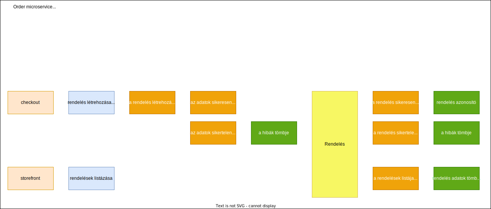

== Event Storming ==

== UML ==

[plantuml]
----
class Order {
    - id: string
    - customer: Customer
    - shippingAddress: ShippingAddress
    - billingAddress: BillingAddress
    - shippingMethod: ShippingMethod
    - billingMethod: BillingMethod
    - products: Product[]
    + getTotal(): number
}

class Product {
    - id: int
    - name: string
    - quantity: number
    - grossPrice: number
}

class ShippingAddress {
    - country: string
    - zipCode: number
    - city: string
    - address: string
}

class BillingAddress {
    - country: string
    - zipCode: number
    - city: string
    - address: string
}

class ShippingMethod {
    - code: string
    - grossPrice: number
}

class BillingMethod {
    - code: string
    - grossPrice: number
}

class Customer {
    - id: string
    - firstName: string
    - lastName: string
    - email: string
    - phoneNumber: string
}

Order "1 "<--"n " Product
Order "1"<-down-"1" Customer
Order "1"<-left-"1" BillingAddress
Order "1"<-left-"1" BillingMethod
Order "1"<-right-"1" ShippingAddress
Order "1"<-right-"1" ShippingMethod

----

== Rest API resources ==

=== POST /api/orders - creates a new order ===

Request:

[source]
----
{
    "checkoutId":"a198730c-e89e-4479-a8bd-587d4de6a68e"
}
----
Response:

[source]
----
{
    "orderId":"140f4f23-07d4-4feb-a9a7-9a22047b71bc"
}
----

=== GET /api/orders - list all orders ===

Request:

[source]
----
{}
----
Response:

[source]
----
{
    "orders": [
        {
            "id":"140f4f23-07d4-asd"
            "customer": {
                "id":"140f4f23-07d4-"
                "firstName": "Teszt"
                "lastName": "Eszter",
                "email": "tester@gmail.com",
                "phoneNumber": "36301234567"
            },
            "shippingAddress": {
                "country": "Magyarország",
                "zipCode": 1234,
                "city": "Otthon",
                "address": "Ucta tér, 2perB"
            },
            "billingAddress": {
                "country": "Magyarország",
                "zipCode": 1234,
                "city": "Otthon",
                "address": "Ucta tér, 2perB"
            },
            "shippingMethod": {
                "code": "gls",
                "grossPrice": 1700,
            },
            "billingMethod": {
                "code": "cod",
                "grossPrice": 1500,
            },
            "products": [
                {
                    "id": "1",
                    "name": "Egykezes fakitermerleő segédeszköz",
                    "quantity": 2,
                    "grossPrice": 23000
                },
                {
                    "id": "2",
                    "name": "Kétkezes fakitermerleő segédeszköz",
                    "quantity": 1,
                    "grossPrice": 35000
                },
                {
                    "id": "3",
                    "name": "Háromkezes fakitermerleő segédeszköz",
                    "quantity": 0.5,
                    "grossPrice": 46000
                }
            ],
            "grossTotal": 107200
        }
    ]
}
----

=== GET /api/orders/+{id}+ - get one specific order ===

Request:

[source]
----
{}
----
Response:
[source]
----
ugyanaz, mint fent csak 1 db objektum
----
