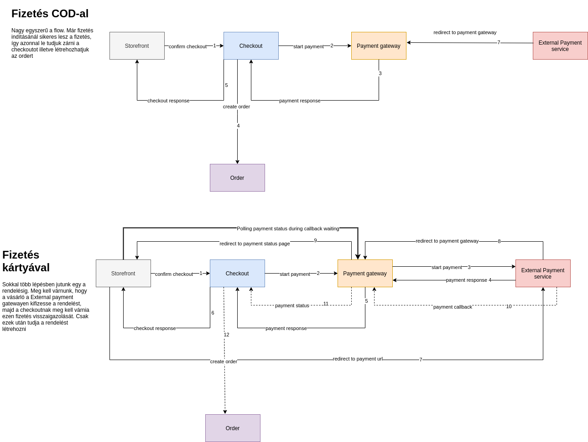

# Checkout microservice

## Leírás

- Szükségünk van egy olyan microservice-re, amelynek egy kosarat átadva, egy új pénztár folyamatot tudunk indítani
- A folyamat tárolja a megrendelés elkészítéséhez szükséges adatokat, úgy mint:
    - A kosár adatai
    - A vásárló adatai
    - A fizetés mód
    - A számlázási adatok
    - A szállítás mód

## Elérhetőség

Külső: http://localhost:8090/checkout
Kódból: http://api_gateway_nginx:8080/checkout

## Szükséges adatok

* _Meg kell tudni adni egy kosarat_
    ** *kosár ID*: egy már létező kosár ID-t kell megadni
* _Lehessen megadni a vásárló általános adatait_:
    ** *email*: formailag helyes email cím
    ** *vezetéknév*
    ** *keresztnév*
    ** *telefonszám*: nem kell validaálni
* _Meg lehessen adni a szállítási adatokat_
    ** *cím*: utca, házszám
    ** *város*
    ** *irányítószám*
    ** *ország*: iso 3166 alpha 2 kód
* _Meg lehessen adni a számlázási adatokat_
    ** *cím*: utca, házszám
    ** *város*
    ** *irányítószám*
    ** *ország*: iso 3166 alpha 2 kód
* _Meg lehessen adni egy fizetési módot_
    ** Payment gateway által visszaadott fizetési mód ID-t kell megadni
* _Meg lehessen adni egy szállítási módot_
    ** Shipping gateway által visszaadott szállítási mód ID-t kell megadni
* _A rendelés rendelkezik egy állapottal_
    ** *függőben lévő*: a pénztár még nem lett lezárva
    ** *megerősítve*: a pénztár lezárva, kifizetésre vár
    ** *fizetve*: a pénztár lezárva, kifizetve

## Funkcionális követelmények

### Pénztár létrehozása

* Hozzatok létre egy végpontot, amelynek egy kosár ID-ját megadva, egy új pénztár folyamatot tudunk indítani. Az új pénztár rendelkezzen egy Id-val.

### Pénztár szerkesztése
* Az adott pénztár addig szerkeszthető, amíg nincs lezárt állapotba,. Mindaddig szabadon módosítható a vásárló adatai, a fizetési és szállítási módok.
* Az adott pénztár összértékénél a kosár összegéhez hozzá kell számolni a szállítási mód illetve a fizetési mód árát.
** Ha szerkesztés után visszadtok egy választ, abben természetesen ez a számolt érték szerepeljen.

### Pénztár lezárása
* A pénztár folyamatot egy végponton le kell tudnunk zárni, ami azt jelenti, hogy:
 ** Megvan-e minden szükséges adat, ami egy rendelés elkészítéséhez szükséges?
 ** A kiválasztott fizetési és szállítási mód a pénztár jelenlegi állapotában használhatóak, tehát ekkor ezt vissza kell ellenőrizni.
 *** Magyarán ellenőrizzük vissza a fizetési és szállítási módokat, hogy a kosár tartalma és a vásárló adatai alapján használhatóak-e, erre használjuk a listázókat a két gatewayből
* A pénztár folyamat lezárása tartalmazza azt a lépést is, hogy a fizetési folyamatot elindítjuk, erre a Payment gatewayben lesz egy végpont
* A pénztár állapotát a státuszával jellezzük

### Rendelés létrehozása

Ha pénztárt sikeresen lezártuk és fizetetté válik, ez esetben el kell indítani a rendelés létrehozását.

### Fizetési folyamatok

A feladat a COD (kézpnzes fizetés) implementálását várja el. A következő képen egy COD és egy bankkártyás fizetés különbségét mutatja be:

