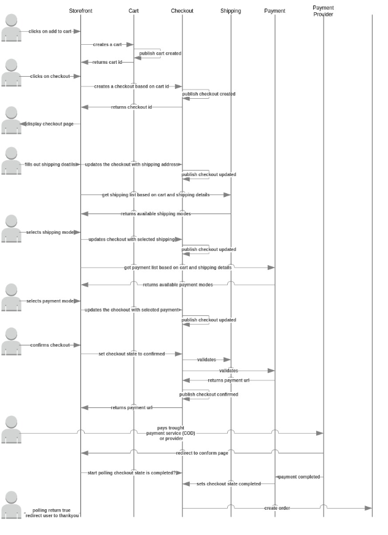

# Mini webáruház microservice-ekkel

## Leírás
Egy webáruház megannyi kontextust tartalmaz, amelyek összességében egy egész webáruházat alkotnak. A feladatotok, hogy egy olyan architektúrát tervezzetek, amelyben ezek a kontextusok külön-külön microservice-ként működnek. A feladat része lesz a domain modellezés és az implementáció.

Kontextusok:

* Termék katalógus
* Kosár
* *Pénztár folyamat*
* *Szállítás mód kezelés*
* *Fizetés mód kezelés*
* *Rendelés kezelés*

A workshop célja, hogy a termékekkel telerakott kosarat rendelésig juttassuk el.

A termék katalógus és a kosár kontextus adott, következő kontextusokat kell implementálnotok
- a pénztár folyamat
- a szállítás mód kezelés
- a fizetés mód kezelés
- a rendelés kezelés

## Modellezés
A DDD lényege, hogy a kontextusunkba tartozó objektumokat előre meg tudjuk határozni aszerint, hogy a mi a business igény és a logika.

A megkapott konkrét feladat esetén, fel kell tárnotok, mik azok a domain object-ek, amelyek részt vesznek a Ti kontextusaitok működésében.

- Entitások
- Value object-ek
- Aggregációk

A domain object-eket UML diagramon kell tudnotok megjeleníteni.

Az ábrákat bármilyen eszközzel el lehet készíteni, ha a plantUML-ben még nem vagytok jártasak

Példa:
https://gitlab.innonic.com/shoprenter/shipping/-/blob/master/docs/model.adoc

## Feladatok

* link:./Context/Checkout.adoc[*Pénztár folyamat*]
* link:./Context/Shipping.adoc[*Szállítás mód kezelés*]
* link:./Context/Payment.adoc[*Fizetés mód kezelés*]
* link:./Context/Order.adoc[*Rendelés kezelés*]

## Technikai információ
- Minden API kérést, amelyet egy másik szervizhez intéztek, az API Gateway-en keresztül tegyétek.
- Bövebb info  link:../README.md[*itt*].

## Péntár folyamat

